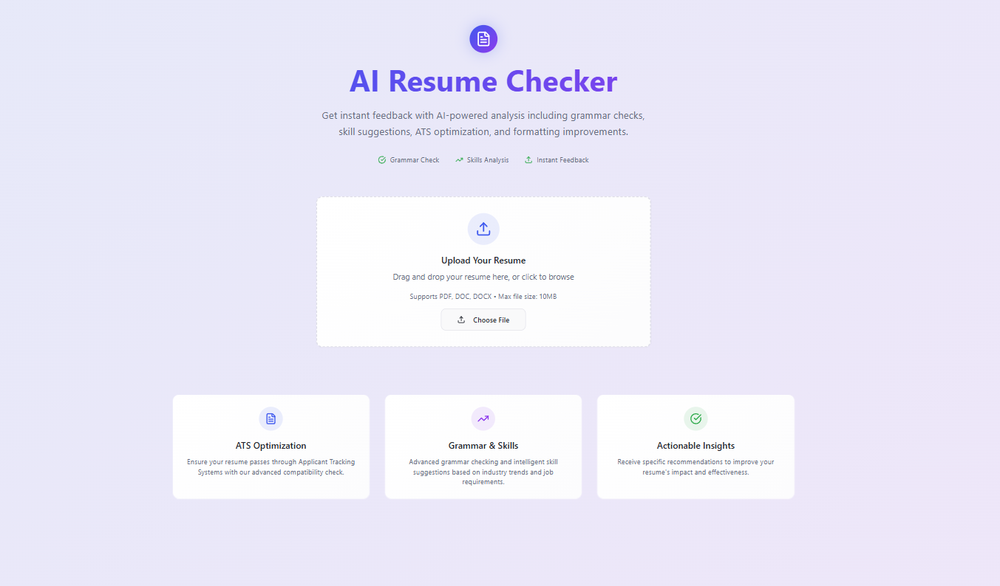

# 📄 AI Resume Checker

AI-powered resume analysis tool that helps job seekers improve their resumes by checking **grammar**, **skills relevance**, **ATS compatibility**, and providing **actionable feedback**.  

Built with modern web technologies for speed, scalability, and clean design.  

---

## ✨ Features

- 📤 Upload resumes in **PDF/DOC/DOCX** format  
- 🧠 Instant AI-powered feedback (grammar, keywords, formatting)  
- ⚡ Fast, lightweight frontend built with Vite + React  
- 🎨 Sleek design system using **Tailwind CSS** + **shadcn-ui**  
- 📱 Fully responsive, mobile-friendly UI  
- 🖥️ Drag & drop support + live validation (file size, format)  

---

## 🛠️ Tech Stack

- [Vite](https://vitejs.dev/) – blazing-fast bundler & dev server  
- [React](https://react.dev/) – component-based UI library  
- [TypeScript](https://www.typescriptlang.org/) – static typing for safer code  
- [Tailwind CSS](https://tailwindcss.com/) – utility-first styling  
- [shadcn-ui](https://ui.shadcn.com/) – prebuilt, accessible UI components  

---
